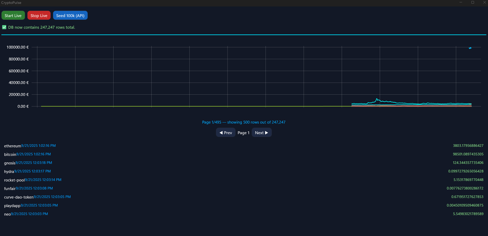
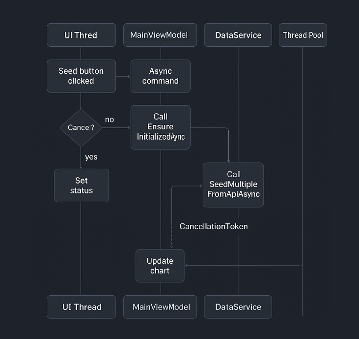

# CryptoPulse

CryptoPulse is a **.NET MAUI cross-platform app** built for the **C# Threading course final assignment**.  
It demonstrates **multi-threading, async tasks, database interaction, and data visualization** in C#.

The app fetches live and historical cryptocurrency data from the **CoinGecko API**, stores it in a local SQLite database, and displays it in charts and tables.

---

## Features
- .NET 8.0 MAUI app with clean **dark-themed GUI**  
- Async + multi-threaded **data seeding** from the CoinGecko API  
- SQLite database with **100,000+ rows** for analysis  
- Data visualization using **LiveChartsCore (SkiaSharp)**  
- PLINQ/async processing in `AnalysisService` for top movers  
- Paging + navigation to browse historical entries  
- Logging (to file + console) and **graceful error handling**  
- `.env` support for CoinGecko **Pro API keys**  

---

## Requirements
- [.NET 8 SDK](https://dotnet.microsoft.com/download/dotnet/8.0)  
- Visual Studio 2022 (latest) with **.NET MAUI workload**  
  *(or JetBrains Rider with MAUI support)*  
- Android/iOS emulator or Windows machine  
- (Optional) CoinGecko Pro API key for higher rate limits  

---

## Setup

### 1. Clone the repository
```bash
git clone https://github.com/yourusername/cryptopulse.git
cd cryptopulse
```

### 2. Install dependencies
MAUI, SkiaSharp, and LiveChartsCore are already listed in the `.csproj`.  
Visual Studio restores them automatically when you build.

### 3. Environment variables
Create a `.env` file in the project root:

```env
COINGECKO_API_KEY=your_api_key_here
```

If no key is provided, the app falls back to the **free CoinGecko API**.

### 4. Build & Run
```bash
dotnet build
dotnet maui run
```
Or press **F5** in Visual Studio.

---

## Usage

1. **Seed 100k rows**  
   - Press **Seed 100k (API)**  
   - App fetches & stores ~100,000 rows into SQLite  
   - Progress shown via progress bar + status  

2. **Browse entries**  
   - Use **Prev** / **Next** buttons for pagination  
   - Current page + total rows displayed  

3. **Charts**  
   - After seeding, charts update with line series  
   - Legend updates dynamically  
   - Top Movers refreshed from DB snapshot  

4. **Live mode**  
   - **Start Live** → begins polling CoinGecko asynchronously  
   - **Stop Live** → cancels background task  

---

## Technical Highlights

### Threading & Async
- `AsyncCommand` → non-blocking UI commands  
- `CancellationTokenSource` → cancel seeding/live loops  
- `Task.WhenAll` → fetch multiple coins in parallel  
- `RunOnUiThreadAsync` → safe UI updates  

### Database
- SQLite local DB (`cryptopulse.db3`)  
- Batch inserts for efficiency  
- Paging support via `GetPageAsync`  
- Snapshots for analysis (`GetSnapshotAsync`)  

### Analysis
- `AnalysisService` computes top movers by % change  
- Async snapshot retrieval → no UI blocking  

### UI
- Built in **XAML** (`MainPage.xaml`)  
- Dark theme + responsive layout  
- **LiveChartsCore (SkiaSharp)** for plotting  

### Logging
- Writes to `cryptopulse.log` (Desktop or Temp folder)  
- Captures boot events + API/DB errors  

---

## Testing & Validation
- DB seeded with ≥100,000 rows across multiple coins  
- Charts validated with both historical + live data  
- Paging verified with large row counts  
- Cancellation tested with **Stop Live**  
- Error handling checked (API offline, invalid key, etc.)  

---

## Example Workflow
1. Launch the app  
2. Hit **Seed 100k (API)** → progress bar fills  
3. Browse data in the SQLite table  
4. Observe chart updates  
5. Start **Live Mode** → auto-fetch prices  
6. Stop live updates gracefully  

---

## Marking Criteria Checklist

This project meets all the **C# Threading final assignment requirements**:

- **C# .NET 8.0** used throughout  
- **Multi-threading** via Tasks, `CancellationToken`, async/await  
- **.NET MAUI** cross-platform app with full GUI  
- **Clean dark-themed UI** using XAML + styling  
- **Version control (Git)** used during development  
- **Database ≥100k rows** (SQLite with seeded CoinGecko data)  
- **Asynchronised I/O calls** (CoinGecko API)  
- **Data visualisation** (LiveChartsCore with SkiaSharp)  
- **Batch processing** of inserts into DB  

---

## Notes
- Without Pro API key → app still works, but free tier has stricter rate limits  
- All **multi-threading features** are in:
  - `MainViewModel`
  - `DataService`
  - `AnalysisService`  

## Images



